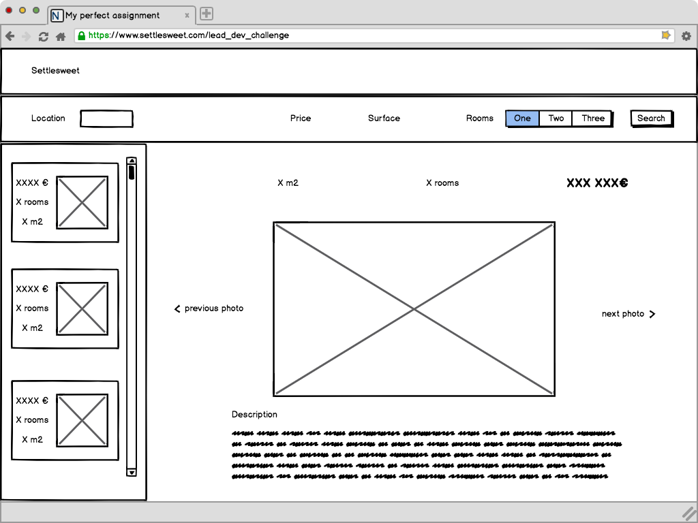

# Settlesweet technical challenge

Looking for a job? Check out our [open positions](https://settlesweet.welcomekit.co/).

## I. Guidelines

- Clone this repo (do **not** fork it)
- Include the `.git` when submiting your test

### 1. Playing with data

**Write code that creates a deduplicated dataset `data/output.csv` file from the dataset in `data/input.csv` and a file `data/duplicate.csv` with all the duplicates identified.**

### 2. A little bit of web

**You will have to code a web app with a user interface (of only one screen) for listings that includes the following :**

- search bar with at least the following parameters : location, price, surface, number of rooms
- a list of the results on the left that displays for each result : photo, number of rooms, surface & price
- When a listing is selected, it should be displayed on the right of the screen with the following information: photo, number of rooms, surface, price, location, description, source url, date of publication

If you need inspiration, you can have a look at this wireframe :

#### Tips:
- Use the dataset `data/output.csv`
- Deploy the app on a private cloud server (heroku, AWS, you are free to use whichever you prefer)
- Extra attention should be put on clear code & documentation
- Use Django framework

## II. Sending Your Results

Once you are done, please send your results to someone from Settlesweet.

- If you are already in discussion with us, send it directly to the person you are talking to.
- If not, use the application form [on every job listing](https://settlesweet.welcomekit.co/).

You can send your Github project link or zip your directory and send it via email.
If you do not use Github, don't forget to attach your `.git` folder.

Good luck and we are looking forward to hearing back from at [Settlesweet](https://settlesweet.com/).
